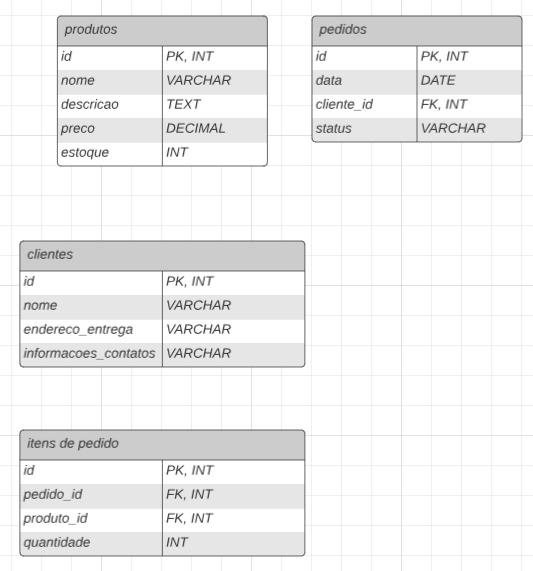

# Sistema de Comércio Eletrônico

Este repositório contém a estrutura de banco de dados e as instruções para um sistema de comércio eletrônico. O sistema permite o gerenciamento de produtos, clientes, pedidos e itens de pedido.

## Estrutura do Banco de Dados

O sistema de comércio eletrônico é composto por quatro tabelas principais:

1. **Produtos:** Armazena informações sobre os produtos disponíveis para venda, incluindo nome, descrição, preço e estoque.

2. **Clientes:** Mantém informações sobre os clientes que podem fazer pedidos, incluindo nome, endereço de entrega e informações de contato.

3. **Pedidos:** Registra os detalhes dos pedidos, como a data do pedido, o cliente associado e o status do pedido.

4. **Itens de Pedido:** Registra os produtos incluídos em cada pedido, juntamente com a quantidade.

## Funcionalidades

O sistema de comércio eletrônico inclui as seguintes funcionalidades:

- Adição de produtos ao carrinho de compras.
- Processamento de pedidos, atualização de estoque e registro de detalhes do pedido.
- Cálculo do total de um pedido com base nos produtos incluídos.
- Visualização do histórico de pedidos de um cliente.
- Visualização de produtos disponíveis.
